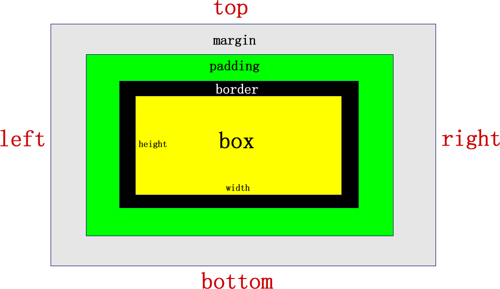

## CSS基础

### 1. 关于CSS

Cascading Style Sheets：层叠样式表

### 2. CSS引入方法

1. 内部样式

   ```html
   <head>
   <style type="text/CSS">
       选择器 {属性1:属性值1; 属性2:属性值2; 属性3:属性值3;}
   </style>
   </head>
   ```

2. 行内样式。标签内添加style属性（不推荐）

   ```html
   <标签名 style="属性1:属性值1; 属性2:属性值2; 属性3:属性值3;"> 内容 </标签名>
   ```

3. 外链样式（最推荐）

   ```html
   <head>
     <link href="CSS文件的路径" type="text/CSS" rel="stylesheet" />
   </head>
   ```

### 3. CSS样式规则


### 4. 属性

#### 4.1 字体样式属性

- font-size：字号大小，默认使用px（像素）作为单位

- font-family：字体属性

  - 可以同时指定多个字体，中间以逗号隔开，表示如果浏览器不支持第一个字体，则会尝试下一个，直到找到合适的字体


-    中文字体需加英文状态下的引号，英文字体不需加引号。当需要设置英文字体时，英文字体名必须位于中文字体名之前

-    font-weight：字体粗细。可用属性值：normal（400）、bold（700）、bolder、lighter、100~900（100的整数倍）

-    font-style：字体风格。可用属性值：normal标、italic斜体、oblique倾斜(?)

-    **font综合设置字体样式**

     ```css
           选择器{font: font-style  font-weight  font-size/line-height  font-family;}
           *必须保留font-size和font-family属性
     ```

#### 4.2 外观样式

- color：文本颜色，属性值有三种方法

  - ​1）	与设定的英文颜色，red、pink、yellow等

    - ​2）十六进制颜色，如#000000黑色（简写为#000）、#FFFFFF白色（简写为#FFF）

    - ​3)RGB颜色，RGB分别填写0-255的数字。另有带透明程度的写法rgba();

  ```css
  rgb(255,255,0);
  rgba(255,255,255,0.4);
  ```

- line-height：行间距

- text-align：水平对齐方式。可用属性值：left、center、right

- text-indent：首行缩进。em为单位，1em为一个汉字的宽度

- letter-spacing：字间距

- word-spacing：单词间距。对中文无效

- text-shadow：文字阴影。默认右、下为正

  ```css
  text-shadow:水平位置 垂直位置 模糊距离 阴影颜色;
  ```

- text-decoration：文本的装饰。参数有none、underline、overline、line-through

#### 4.3 元素的显示与隐藏

- display：**隐藏后不再保留位置**

  ```css
  display：none；
  ```

- visibility：**隐藏后继续保留原位置**

  ```css
  visibility：visible；			//可见
  visibility: hidden；			//隐藏
  ```


- overflow：溢出处理方式

  ```css
  overflow：visible;		//不剪切也不添加滚动条
  overflow：auto；		//溢出部分自动添加滚动条
  overflow：hidden；	//溢出部分隐藏
  overflow：scroll；	//不管是不是溢出都会显示滚动条
  ```

#### 4.4 鼠标样式cursor

```css
cursor：default pointer move text；		//默认  点击  移动  文本编辑
```

#### 4.5 word-break:自动换行

​	normal   使用浏览器默认的换行规则。

​	break-all   允许在单词内换行。

​	keep-all    只能在半角空格或连字符处换行。

​	主要处理英文单词

#### 4.6 white-space

​	white-space设置或检索对象内文本显示方式。通常我们使用于强制一行显示内容 

​	normal : 　默认处理方式
​	nowrap : 　强制在同一行内显示所有文本，直到文本结束或者遭遇br标签对象才换行。

​	可以处理中文

#### 4.7 text-overflow 文字溢出

​	text-overflow : clip | ellipsis

​	设置或检索是否使用一个省略标记（...）标示对象内文本的溢出

​	clip : 　不显示省略标记（...），而是简单的裁切 

​	ellipsis : 　当对象内文本溢出时显示省略标记（...）

​	注意一定要首先强制一行内显示，再次和overflow属性  搭配使用

### 5. 选择器

#### 5.1 选择器分类

- 标签选择器（元素选择器）
- 类选择器
- ID选择器
- 伪类选择器：伪类选择器用于向某些选择器添加特殊的效果。
  - 链接伪类选择器
    - :link      /* 未访问的链接 */
    - :visited   /* 已访问的链接 */
    - :hover     /* 鼠标移动到链接上 */
    - :active    /* 选定的链接 */

  - 结构伪类选择器
    - :first-child :选取属于其父元素的首个子元素的指定选择器
    - :last-child :选取属于其父元素的最后一个子元素的指定选择器
    - :nth-child(n) ： 匹配属于其父元素的第 N 个子元素，不论元素的类型

  - 目标伪类选择器

    -  :target目标伪类选择器 :选择器可用于选取当前活动的目标元素。只有在目标为a标签并指向另一个标签时才生效

    ```html
      css样式
           #big-bam-boom:target {
               color: red;
           }
      html
      	<h1 id="big-bam-boom">Kaplow!</h1>
      	<a href="#big-bam-boom">Mission Control, we're a little parched up here.</a>
    ```

#### 5.2 复合选择器

- 交集选择器：既是...又是...的意思，两个选择器之间**无任何字符**。不常用

  ```css
  .one.two {color: #F00;}
  ```


- 并集选择器：使用**逗号**分隔

  ```css
  .one, p , #test {color: #F00;}
  ```


- 后代选择器：外层标签写前面，内层标签写后面，使用**空格**分开

  ```css
  .one p #test {color: #F00;}
  ```


- 父子选择器：直属父子关系的选择器，使用**>**分开

  ```css
  .one >p >#test {color: #F00;}
  ```


- 属性选择器（不常用）

  ```css
  div[class^=font] { /*  class^=font 表示 font 开始位置就行了 */
  			color: pink;
  		}
  div[class$=footer] { /*  class$=footer 表示 footer 结束位置就行了 */
  			color: skyblue;
  		}
  div[class*=tao] { /* class*=tao  *=  表示tao 在任意位置都可以 */
  			color: green;
  		}
  ```

  ```html
  <div class="font12">属性选择器</div>
  <div class="font12">属性选择器</div>
  <div class="font24">属性选择器</div>
  <div class="font24">属性选择器</div>
  <div class="font24">属性选择器</div>
  <div class="24font">属性选择器123</div>
  <div class="sub-footer">属性选择器footer</div>
  <div class="jd-footer">属性选择器footer</div>
  <div class="news-tao-nav">属性选择器</div>
  <div class="news-tao-header">属性选择器</div>
  <div class="tao-header">属性选择器</div>
  ```


- 伪元素选择器（**CSS3**中属性）

1. E::first-letter文本的第一个单词或字（如中文、日文、韩文等）

2. E::first-line 文本第一行

3. E::selection 可改变选中文本的样式

4. E::before和E::after   在E元素内部的开始位置和结束位创建一个元素，该元素为**行内元素**，且必须要结合content属性使用。

   ```css
   p::first-letter {
     font-size: 20px;
     color: hotpink;
   }

   /* 首行特殊样式 */
   p::first-line {
     color: skyblue;
   }

   p::selection {
     /* font-size: 50px; */
     color: orange;
   }

   div::befor {
     content:"开始";
   }
   div::after {
     content:"结束";
   }
   ```

### 6. CSS三大特性

```
总结：权重是优先级的算法，层叠是优先级的表现
```

#### 6.1 层叠性

样式冲突，以后一个样式为准。“内联属性”——>“写在 style标签里”——>“外部链接”：以写在文件上代码行越靠下的为准

#### 6.2 继承性

子元素会继承父元素的样式特性

- 不可继承的：

  **display**、**margin**、**border**、**padding**、**background**、**height**、min-height、max-height、**width**、min-width、max-width、**overflow**、**position**、**left**、**right**、**top**、**bottom**、**z-index**、**float**、**clear**、table-layout、vertical-align、page-break-after、page-bread-before和unicode-bidi。 


- 所有元素可继承：visibility和cursor。 


- **内联元素可继承：主要时字体类样式和外观类样式**

  **letter-spacing、word-spacing、white-space、line-height、color、font、font-family、font-size、font-style、font-variant、font-weight、text-decoration、text-transform、direction。** 

- 终端块状元素可继承：text-indent和text-align。 


- 列表元素可继承：list-style、list-style-type、list-style-position、list-style-image。


#### 6.3 特殊性（优先级）

​	子元素继承来的样式权重为0

| 继承或者* 的贡献值      | 0,0,0,0 |
| --------------- | ------- |
| 每个元素（标签）贡献值为    | 0,0,0,1 |
| 每个类，伪类贡献值为      | 0,0,1,0 |
| 每个ID贡献值为        | 0,1,0,0 |
| 每个行内样式贡献值       | 1,0,0,0 |
| 每个!important贡献值 | ∞ 无穷大   |

#### 6.4 权重精华练习（重要）

```html
	<head>
		<meta http-equiv="content-type" content="text/html;charset=utf-8" />
		<meta name="keywords" content="关键词1,关键词2,关键词3" />
		<meta name="description" content="对网站的描述" />
		<title>第1题</title>
		<style type="text/css">
			#father #son{  
				color:blue;
			}						0200--正确答案
			#father p.c2{
				color:black;
			}						0111
			div.c1 p.c2{
				color:red;
			}						0022
			#father{
				color:green !important;  /* 继承的权重为0 */
			}						0000
		</style>
	</head>
	<body>
		<div id="father" class="c1">
			<p id="son" class="c2">
				试问这行字体是什么颜色的？
			</p>
		</div>
	</body>
```

```html
<head>
	<meta http-equiv="Content-Type" content="text/html;charset=UTF-8">
	<title>Document</title>
	<style type="text/css">
		div div div div div div div div div div div div{  
			color:red;			0，0，0，11
		}
		.me{ 
			color:blue;			0010---正确答案
		}
	</style>
</head>
<body>
	<div>
		<div>
			<div>
				<div>
					<div>
						<div>
							<div>
								<div>
									<div>
										<div>
											<div>
												<div class="me">试问这行文字是什么颜色的</div>
											</div>
										</div>
									</div>
								</div>
							</div>
						</div>
					</div>
				</div>
			</div>
		</div>
	</div>
</body>
```

```html
<head>
	<meta http-equiv="Content-Type" content="text/html;charset=UTF-8">
	<title>Document</title>
	<style type="text/css">
		.c1 .c2 div{  
			color: blue;			0021
		}
		div #box3{
			color:green;			0101
		}
		#box1 div{
			color:yellow;			0101----正确答案，相同时就近
		}
	</style>
</head>
<body>
	<div id="box1" class="c1">
		<div id="box2" class="c2">
			<div id="box3" class="c3">
				试问这行文字是什么颜色的
			</div>
		</div>
	</div>
</body>
```

### 7. 标签显示模式

#### 7.1 块级元素block

- 常见的块级元素：div、h1~h6、p、ul、ol、li

- 特点

  1. 总是从新的一行开始

  2. 宽高、行高、内外边距都可控制

  3. 默认宽度时容器的100%

  4. 可以容纳内联元素及其他块级元素

     **特殊：h1~h5、p标签虽是块级标签，但其中只能放文本**

#### 7.2 行内元素inline

- 常见行内元素：a、b、i、s、u、span

- 特点

  1. 和相邻行内元素在同一行上

  2. 宽高无效；水平方向内外边距可控，垂直方向无效

  3. 默认宽度为本身内容的宽度

  4. 只能容纳文本或其他行内元素

     **特殊：链接标签中不能再放链接标签**

#### 7.3 行内块元素inline-block

- 常见行内块元素：img、input、td
- 特点
  1. 和相邻行内块元素在同一行上，但之间会有空白间隙
  2. 默认宽度为本身内容的宽度
  3. 宽高、行高、内外边距都可以控制

#### 7.4 标签显示模式转换

使用dispaly

### 8. 背景background

- background-color：背景颜色
- background-image：背景图片，url地址添加
- background-repeat：背景平铺，参数如下
  - repeat		背景图片在纵向和横向上平铺（默认）
  - no-repeat      背景图片不平铺
  - repeat-x         背景图片横向平铺
  - repeat-y         背景图片纵向平铺


- background-position：背景图片的位置

  ```css
  background-position: 55px 15px;		//left top
  background-position: right bottom;	//可选择的选项有top、bottom、left、right、center
  ```


- background-attachment：背景附着，参数如下
  - scroll：背景图片随对象内容滚动（默认）
  - fixed：背景图片固定


- background-size：（CSS3）背景缩放，用法如下：
  - 可以设置背景的大小，数字或百分比
  - **cover：根据容器的大小，始终填充满背景区域，超出会溢出**
  - contain：自动缩放图片，始终保证图片被完成显示

##### 背景设置简写

**background：背景颜色	背景图片		背景平铺		背景滚动		背景位置**

```css
background: pink url(timg.jpg) no-repeat scroll 55px 30px;
```

### 9. 盒子模型



#### 9.1 边框border

- border样式：none、solid实线、dashed虚线、dotted点线、double双实线

  ```css
  border： 1px solid black；
  ```


- 圆角边框

  可用数字+px或百分比（50%代表正圆弧）

  ```css
  border-radius： 左上角	右上角	左下角	右下角；
  border-radius： 左上角&右下角	右上角&左下角；（对角线）
  ```

#### 9.2 内边距padding

```css
padding： 10px；					上下左右均为10px
padding： 10px 20px；				上下为10px，左右为20px
padding： 10px 20px 30px；		上为10px，左右为20px，下为30px
padding： 10px 20px 30px 40px；	上 右 下 左
```

#### 9.3 外边距margin

用法跟padding基本相同

- 用margin实现盒子水平居中，盒子本身满足以下条件

  - 必须为块级元素
  - 已经设置了width

  ```css
  margin： 0 auto；
  ```

#### 9.4 ☆外边距合并（重点）

- 相邻兄弟块元素，相邻边的外边距以较大的外边距为准。也称**外边距塌陷**
  - 解决方法：避免


- 父子元素，若父元素未规定上外边距及边框，则子元素和父元素的上外边距会发生合并，合并后的上外边距以较大的为准，且子元素和父元素的上边框会重合
  - 解决方法
    1. 给父元素添加overflow:hidden，会触发**BFC**
    2. 给父元素添加边框border: 1px solid transparent    //透明的
    3. 给父元素或者子元素添加浮动或者定位absolute


#### 9.5 盒子阴影

```css
box-shadow： 水平阴影	垂直阴影	[模糊距离	阴影尺寸	阴影颜色	内/外阴影]；
```

### 10. 浮动

#### 10.1 CSS的定位机制

1. 标准流（普通流）normal flow：以块元素、行元素的特性排列
2. 浮动 folat：脱离标准流的控制，移动到父元素中指定位置
3. 定位position

#### 10.2 ☆清除浮动（重点）

##### 清除浮动的本质

由于子级元素浮动，造成父级元素无法被撑开内部高度为0的问题


##### 清除浮动的方法

- 触发BFC机制，给父级元素添加overflowl：hidden；	但此方法会隐藏掉超出盒子的内容（不实用）

- **使用before和after双伪元素清除浮动**（推荐）

  ```css
  .clearfix:before,
  .clearfix:after {   
  	content:"";  display:table; 
  	}
  .clearfix:after {	
    	clear:both;
  }
  .clearfix {
    	*zoom:1;
  }
  ```

上述代码可以写在css中，需要清除浮动时给估计元素添加.clearfix类属性

### 11. 定位

#### 11.1 定位属性

1. static：静态定位，默认位置
2. **absolute**：绝对位置，相对于父元素，常用“**子绝父相**”；若所有父级元素都无定位属性，以浏览器对齐。**完全脱标，不占有位置**
3. **relative**：相对定位，相对与自己的位置。**不脱标，占有位置**
4. fixed：固定位置，相对于浏览器窗口。**完全脱标，不占有位置**

#### 11.2 叠放次序（z-index）

可以对定位元素应用z-index层叠等级属性，其取值可为正整数、负整数和0（默认）。有如下特点

1. **只有相对定位，绝对定位，固定定位有此属性**，其余标准流，浮动，静态定位都无此属性，亦不可指定此属性
2. 值越大，叠放越居上
3. 若取值相同，则根据书写顺序，后来居上

```css
z-index：2；		后面不能家单位
```

### 12. BFC（重点）

Block Format Context：块级格式化上下文

#### 12.1 满足BFC条件的元素资质

dispaly属性为block、list-item、table的元素

#### 12.2 触发BFC的条件

1. **float**属性不为none
2. **position**为absolute或fixed
3. **display**为inline-block, table-cell, table-caption, **flex**, inline-flex
4. **overflow**不为visible

#### 12.3 BFC中元素的特性

1. 在BFC中，盒子从顶端开始垂直地一个接一个地排列
2. 盒子垂直方向的距离由margin决定。属于同一个BFC的两个相邻盒子的margin会发生重叠
3. 在BFC中，每一个盒子的左外边缘（margin-left）会触碰到容器的左边缘(border-left)

#### 12.4 BFC的用途

1. **清除浮动**
2. **解决外边距合并**
3. 制作右侧自适应的盒子（？具体不详）

### 伪元素的使用方法

之所以被称为伪元素，是因为他们不是真正的页面元素，html没有对应的元素，但是其所有用法和表现行为与真正的页面元素一样

**注意**

**伪元素:before和:after添加的内容默认是inline元素**；这个两个伪元素的`content`属性，表示伪元素的内容,设置:before和:after时必须设置其`content`属性，否则伪元素就不起作用。--可参考清除浮动的方法

### 过渡动画

在CSS3里使用transition可以实现补间动画（过渡效果），并且当前元素只要有“属性”发生变化时即存在两种状态(我们用A和B代指），就可以实现平滑的过渡。参数有：

- transition-property：CSS属性名称
- transition-duration：过渡花费的时间，需加单位s。默认为0
- transition-timing-function：运动曲线。有linnear匀速，ease渐缓，ease-in加速，ease-out减速，ease-in-out加速后减速
- transition-delay：延迟时间

```css
transition: 要过渡的属性  花费时间  运动曲线  何时开始;
如果有多组属性变化，还是用逗号隔开
transition: width 0.6s ease 0s, height 0.3s ease-in 1s;
```


### 图像变形

#### 平面操作

- translate移动

  ```css
  transform：translate( x, y);
  transform：translateX( x );
  transform：translateY( y );
  ```


- scale缩放

  ```css
  transform：scale( 0.5, 1.4);
  transform：scaleX( 0.4 );
  transform：scaleY( 0.4 );
  ```


- rotagte旋转，需配合transform-origin旋转中心使用；**旋转角度必须加单位deg**

  ```css
  transform-origin：left top; //适用于有边角的图形
  transform-origin：10px 20px；	//也可使用具体坐标设置旋转中心
  transform：rotate(15deg);	
  ```


- 倾斜skew

  ```css
  transform:skew(30deg,0deg);		//分别沿x、y方向倾斜，第二个数值不跳默认为0
  ```

#### 立体操作

- 绕轴旋转
  - rotateX：横轴
  - rotateY：纵轴
  - rotateZ：屏幕垂直方向轴

- 透视效果

  原理：近大远小的原理，通过调整视距perspective，模拟视觉效果时人眼的位置

  ```css
  给产生立体动画的父元素添加属性：
  perspective：700px；
  ```


- 三维位移
  - translateX(x);
  - translateY(y);
  - translateZ(z);
  - translate3d(x,y,z);


- 背面隐藏

  ```css
  backfacevisibility：hidden； 	//背面对象就隐藏
  ```

### 动画

- 定义动画

  ```css
  @keyframes goback {
    0%{}
    49%{
      transform: translateX(1000px);
    }
    55%{
      transform: translateX(1000px) rotateY(180deg);
    }
    95%{
      transform: translateX(0) rotateY(180deg);
    }
    100%{
      transform: translateX(0) rotateY(0deg);
    }
  }
  ```


- 添加动画属性

  ```css
  animation:动画名称 动画时间 运动曲线  何时开始  播放次数  是否反方向;   	
  ```


- 常用属性

  ```css
  animation-iteration-count:infinite;  无限循环播放
  animation-play-state:paused;   暂停动画"
  ```

### 伸缩布局

- 父元素的属性设置

  ```css
  display：flex；
  最小最大值
  min-width：260px；
  max-width：1080px；
  排列方向，默认为水平方向
  flex-direction：column；	垂直排列，后接 -reverse为反向
  flex-direction：row；
  ```
  - **justify-content**调整主轴水平对齐：

    flex-start 默认，容器开头

    flex-end	容器结尾 

    center 居中

    space-between 左右贴近盒子边界，中间平均分配

    space-around 之前、之后、之间都留有平均分配空白

  - **align-items**调整侧轴垂直对齐：

    strech 默认，项目被拉伸以适应容器

    center 居中

    flex-start、flex-end

  - **flex-wrap** 控制换行，当子盒子超过父盒子宽度时

    nowrap  默认不换行，强制一行内显示

    wrap  必要时拆行或换行

    wrap-reserve  反向

  - 简写**flex-flow**：flex-direction、flex-wrap的简写形式

    ```css
    flex-flow: flex-direction  flex-wrap; 
    ```

  - **align-content**堆栈（由flex-wrap产生的独立行）多行垂直对齐方式齐

    align-content是针对flex容器里面多轴(多行)的情况,align-items是针对一行的情况进行排列。

    必须对父元素设置自由盒属性display:flex;，并且设置排列方式为横向排列flex-direction:row;并且设置换行，flex-wrap:wrap;这样这个属性的设置才会起作用。

    | 值             | 描述                       |
    | ------------- | ------------------------ |
    | stretch       | 默认值。项目被拉伸以适应容器。          |
    | center        | 项目位于容器的中心。               |
    | flex-start    | 项目位于容器的开头。               |
    | flex-end      | 项目位于容器的结尾。               |
    | space-between | 项目位于各行之间留有空白的容器内。        |
    | space-around  | 项目位于各行之前、之间、之后都留有空白的容器内。 |

- 子元素的属性设置  

  - flex：1；    填写数字，伸缩分配比例
  - order：2；order控制子项目的排列顺序，正序方式排序。可以为负值。 默认值是 0